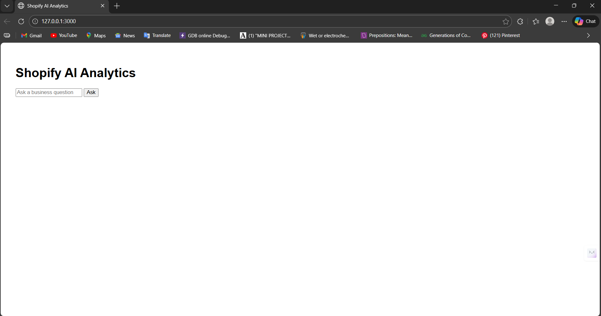
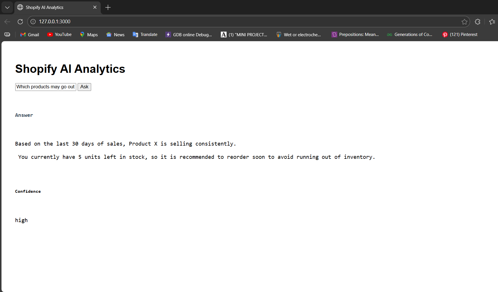
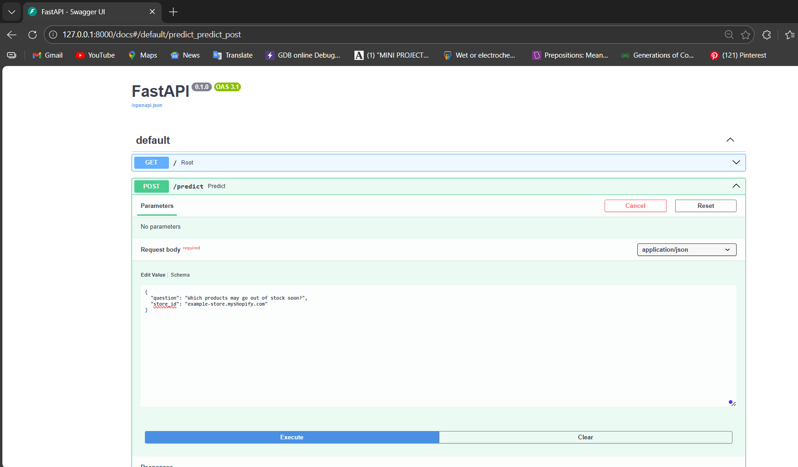

# AI-Powered Shopify Analytics App

This project is an AI-powered analytics application for Shopify stores.
It allows users to ask business questions in natural language and receive
clear, actionable insights related to sales, inventory, and customers.

## Objective

The goal of this project is to demonstrate system design and agent-based
reasoning by building a mini analytics platform that converts natural
language questions into ShopifyQL-style queries.

## Architecture Overview

Frontend : HTML / JS
|
v
Rails API : Gateway Layer
|
v
Python AI Service : FastAPI

## Tech Stack

- Frontend: HTML, JavaScript
- Backend API: Ruby on Rails (API-only)
- AI Service: Python with FastAPI
- Agent Logic: Rule-based / Mocked LLM

## Agent Workflow

The system follows an agent-based workflow:

1. User submits a natural language question
2. The agent identifies user intent (sales, inventory, customers)
3. A ShopifyQL-style query is generated
4. Data is processed (mocked)
5. Results are explained in simple business language

## API Endpoints

### POST /api/v1/questions

**Request:**
```json
{
  "store_id": "example-store.myshopify.com",
  "question": "Which products may go out of stock soon?"
}
```

**Response:**
```json
{
  "answer": "Product X may go out of stock in the next 7 days.",
  "confidence": "high"
}
```

## Setup Instructions (IMPORTANT)

### Start Python AI Service

```bash
cd python-ai-service
pip install fastapi uvicorn
python -m uvicorn main:app --reload --port 8000
```

### Start Rails Backend

```bash
cd rails-backend
bundle install
bundle exec rails s -p 3000
```

## Mocked AI Logic

The AI/LLM layer is intentionally mocked to ensure system stability.
The assignment allows mocking, and the focus is on architecture and
agent reasoning rather than third-party API dependencies.

No real Shopify data or external LLM APIs are used in this version.

## Screenshots

### User Interface


### Answer Generated by AI Agent


### API Integration (Rails ↔ Python)



## Conclusion

This project demonstrates clean API design, agent-based workflows,
and practical system architecture that can be extended to real Shopify
and LLM integrations in the future.